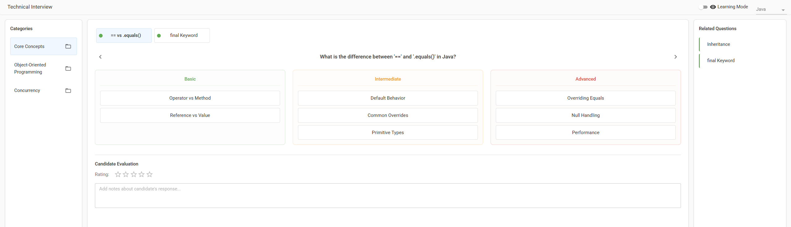

# Technical Interview Platform

A modern React application for conducting technical interviews with a focus on optimal UX for recruiters and interviewers.

## Project Overview

This platform is designed to help recruiters conduct technical interviews efficiently by providing a structured database of questions organized by programming language and category. It focuses solely on the interviewer experience and does not handle candidate information.



### Key Features

- **Question Database**: Organized by language, category, and skill level
- **Answer Insights**: Three levels of sophistication for each answer (Basic, Intermediate, Advanced)
- **Interview Tools**: Note-taking and 1-5 rating system per question
- **Learning Mode**: Option to hide answer details until hovered for self-assessment
- **Related Questions**: Suggested follow-up questions for interview flow
- **File Management**: Ability to select which question files to include in a category

## File Structure

```
interview-platform/
├── package.json
├── README.md
├── public/
│   └── index.html
├── src/
│   ├── App.js
│   ├── index.js
│   ├── components/
│   │   ├── InterviewPanel.js       # Main interview interface
│   │   ├── AnswerLevelHorizontal.js # Answer display component
│   │   └── [other components]
│   ├── data/
│   │   ├── questionLoader.js       # Functions to load/manage questions
│   │   └── questions/              # Question data files
│   │       ├── java/
│   │       │   ├── core-concepts/
│   │       │   │   ├── core-concepts-konrad-1.json
│   │       │   │   └── core-concepts-[developer]-[number].json
│   │       │   ├── oop/
│   │       │   │   ├── oop-konrad-1.json
│   │       │   │   └── oop-[developer]-[number].json
│   │       │   └── concurrency/
│   │       │       ├── concurrency-konrad-1.json
│   │       │       └── concurrency-[developer]-[number].json
│   │       ├── python/             # (Future expansion)
│   │       └── javascript/         # (Future expansion)
│   └── styles/
│       └── main.css
```

## Developer Question Contribution

The file structure is designed to allow multiple developers to contribute their own question sets within the same category:

1. Each developer can create their own JSON files named with their identifier
2. Files follow the pattern: `[category]-[developer]-[details].json`
3. The questionLoader imports these individual files
4. Interviewers can select which developers' files to include in an interview session

This approach allows:
- Team collaboration with clear ownership
- Easy management of which question sets to use
- The ability to separate questions into different categories
- Simple git-based tracking of contributions

## Question Format

Questions are stored in JSON files organized by language, category, and developer. Each file can contain multiple questions. The file structure is designed to be human-readable and maintainable for inner source git projects.

### JSON File Structure

```json
{
  "category": "Category Name",
  "questions": [
    {
      "id": "unique-question-id",
      "category": "Language",
      "subcategory": "Category Name",
      "skillLevel": "beginner|intermediate|advanced",
      "shortTitle": "Short Display Title",
      "question": "The full question text",
      "answerInsights": [
        {
          "category": "Basic",
          "points": [
            {
              "title": "Concise Point Title",
              "description": "Detailed explanation of the point"
            },
            // More points...
          ]
        },
        {
          "category": "Intermediate",
          "points": [
            // Similar structure...
          ]
        },
        {
          "category": "Advanced",
          "points": [
            // Similar structure...
          ]
        }
      ],
      "relatedQuestions": ["id-of-related-question-1", "id-of-related-question-2"]
    },
    // More questions...
  ]
}
```

### Question Properties

| Property | Description | Required |
|----------|-------------|----------|
| id | Unique identifier for the question (descriptive, not numeric) | Yes |
| category | Programming language (Java, Python, etc.) | Yes |
| subcategory | Topic area within the language | Yes |
| skillLevel | Difficulty level (beginner, intermediate, advanced) | Yes |
| shortTitle | Brief title for display in the UI (max ~20 chars) | Yes |
| question | The full question text | Yes |
| answerInsights | Three categories of answer points | Yes |
| relatedQuestions | Array of question IDs that are related to this one | No |

### Answer Insights Structure

Each question must have three levels of answer insights:

1. **Basic**: Fundamental understanding that any candidate should have
2. **Intermediate**: Deeper knowledge expected from experienced developers
3. **Advanced**: Sophisticated understanding showing expert-level knowledge

Each insight category contains multiple points, each with:
- **title**: A concise, clear statement (this is always visible in the UI)
- **description**: A detailed explanation that appears when hovering over the title

## UI Requirements

### Layout

- **Three-Column Layout**:
  - Left panel: Categories (fixed width: 250px)
  - Center panel: Current question and answer (flexible width)
  - Right panel: Related questions (fixed width: 300px)

### Visual Elements

- **Color Coding**:
  - Beginner: Green
  - Intermediate: Orange
  - Advanced: Red

- **Hover Tooltips**:
  - Large, readable tooltips for answer details
  - Disappear quickly when mouse moves away
  - Code blocks properly formatted in tooltips

- **Learning Mode**:
  - Toggle in top-right to hide answer bullet points
  - Shows placeholders until hovered
  - Useful for self-assessment or cleaner UI

### Question Navigation

- Questions display as a horizontal list at the top of the main panel
- Each question shows a colored circle indicating skill level
- Short titles should be centered and consistent

### Categories and Files

- Categories listed in left panel
- File selection via dropdown when clicking folder icon
- Multiple files can be selected/deselected per category

## Adding New Questions

### Step 1: Create Your Own Question File

1. Determine which category your questions belong to
2. Create a new file following the naming convention: `[category]-[your-name]-[number].json`
   - Example: `core-concepts-jane-1.json`

### Step 2: Structure Your Question File

Create your question file with the standard format:

```json
{
  "category": "Core Concepts",
  "questions": [
    // Your question objects go here
  ]
}
```

### Step 3: Create Question Objects

Add one or more question objects following the format above. Ensure you:

1. Use descriptive, unique IDs (e.g., `java-lambda-expressions`)
2. Provide short, clear titles for UI display
3. Specify the correct category, subcategory, and skill level
4. Write clear, complete question statements

### Step 4: Craft Answer Insights

For each level (Basic, Intermediate, Advanced):

1. Create 2-4 key points with clear, concise titles
2. Write detailed descriptions for each point
3. Ensure proper formatting for code examples using triple backticks
4. Make each level progressively more sophisticated

### Step 5: Add Related Questions

Link to 1-3 related questions that would make good follow-ups during an interview.

### Step 6: Update Question Loader

Import your new file in `questionLoader.js` and add it to the appropriate collections:

```javascript
// Import your new file
import coreConcepts2 from './questions/java/core-concepts/core-concepts-jane-1.json';

// Add to the question files mapping
export const questionFiles = {
  java: {
    'core-concepts': [javaCoreConceptsFile, coreConcepts2],
    // other categories...
  },
  // other languages...
};
```

## Technical Details

### State Management

- Question state is managed at the `InterviewPanel` level
- Selections, notes, and ratings persist during the session
- Category and file selections update the available questions

### Tooltips and Hovering

- Tooltips use the MUI Popper component
- Hover state is managed via React state, not just CSS
- Timeouts ensure tooltips disappear after 300ms when mouse leaves

### Learning Mode

- Replaces bullet point text with placeholder bars
- Shows content only on active hover
- Tracks hover state via React rather than CSS-only

## Example Question

Here's an example of a well-structured question:

```json
{
  "id": "java-equals-vs-operator",
  "category": "Java",
  "subcategory": "Core Concepts",
  "skillLevel": "beginner",
  "shortTitle": "== vs .equals()",
  "question": "What is the difference between '==' and '.equals()' in Java?",
  "answerInsights": [
    {
      "category": "Basic",
      "points": [
        {
          "title": "Operator vs Method",
          "description": "== is an operator, while .equals() is a method that belongs to the Object class."
        },
        {
          "title": "Reference vs Value",
          "description": "== compares object references (memory addresses), while .equals() compares the object values."
        }
      ]
    },
    {
      "category": "Intermediate",
      "points": [
        {
          "title": "Default Behavior",
          "description": "By default, .equals() in the Object class actually uses == for comparison unless overridden by a subclass."
        },
        {
          "title": "Common Overrides",
          "description": "String, Integer, and most wrapper classes override .equals() to compare actual values instead of references."
        }
      ]
    },
    {
      "category": "Advanced",
      "points": [
        {
          "title": "Overriding Equals",
          "description": "When overriding .equals(), you should always override hashCode() as well to maintain the contract that equal objects must have equal hash codes."
        },
        {
          "title": "Null Handling",
          "description": "Using == with null is safe (obj == null), but calling .equals() on a null object throws NullPointerException."
        }
      ]
    }
  ],
  "relatedQuestions": ["java-hashcode", "java-string-pool"]
}
```

## Installation and Setup

```bash
# Install dependencies
npm install

# Start development server
npm start

# Build for production
npm run build
```

## Browser Compatibility

The application is designed to work in modern browsers (Chrome, Firefox, Safari, Edge).